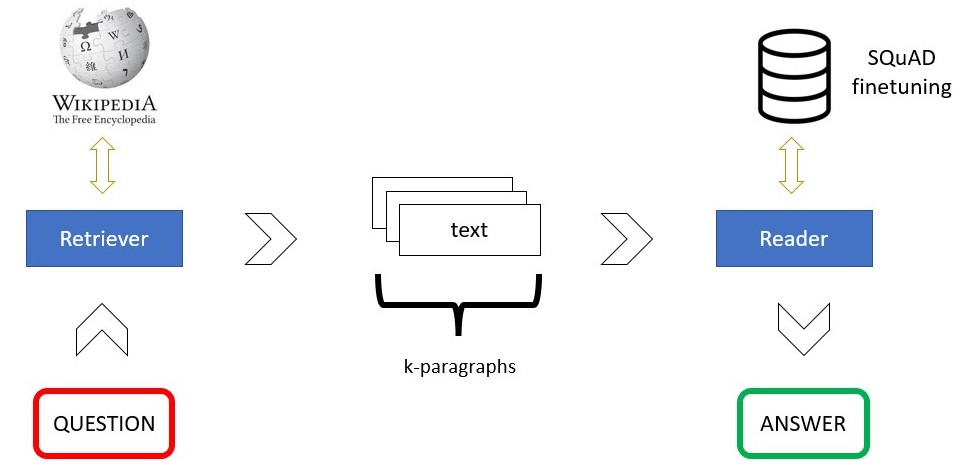

## Question Answering with BERTserini

This is the workflow of the BERTserini QA system:



## Installation

Experiments have been made on Google Colab, using Python 3.7.13 and Torch 1.11.0+cu113. 

The other requirements can be found in the file _requirements.txt_ and you can easily install them via pip
```console
pip install -r requirements.txt
```

## Finetuning

In order to finetune BERT on SQuAD, you can run [finetune.py](bertserini/model/finetune.py).
Use this command to have more informations about the arguments to pass:
```console
python bertserini/model/finetune.py --help
```

## Inference

To answer a question, you can run [inference.py](inference.py).
As for finetuning, type this to have info about command line arguments:
```console
python inference.py --help
```

## Evaluation

If you want to test the pipeline performances, use [evaluation.py](evaluation.py).
```console
python evaluation.py --help
```

## Examples
